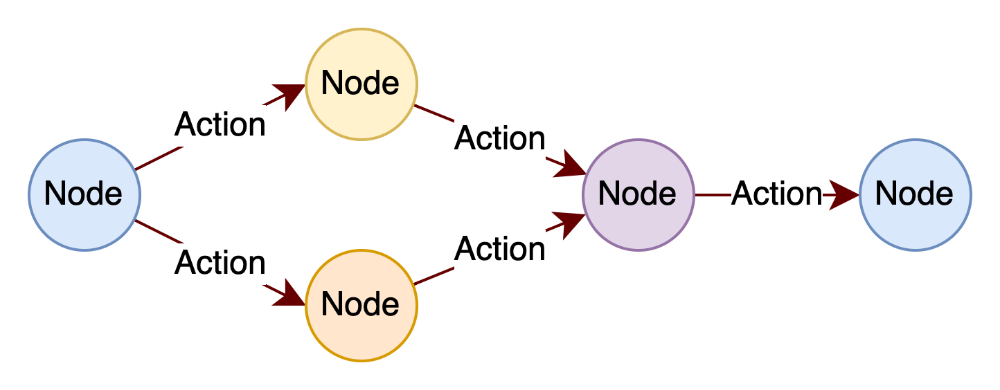

# FlowEngine
This is a sample project to study how to make a Flow Engine.
# Elements in Project
There are three core elements in FlowEngine project: Node, Action and Flow. 
## Flow

Like above picture, one Flow is contain of two or more Nodes and one or more Actions. And the flow should begin with a StartNode, then end with a EndNode.
## Node

## Action