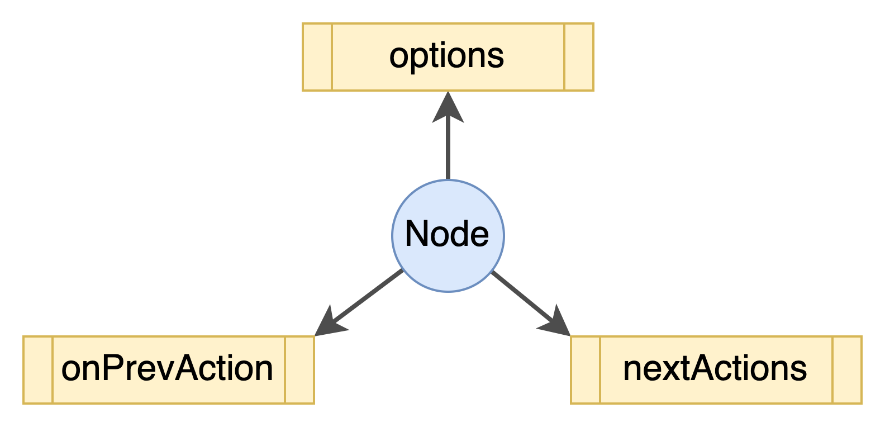

# FlowEngine
This is a sample project to study how to make a Flow Engine.
# Elements in Project
There are three core elements in FlowEngine project: Flow, Node, and Action. 
## Flow

As above picture, one Flow is contain of two or more Nodes and one or more Actions. And the flow should be began with a StartNode, then ended with a EndNode.

The imporantest field is `nodes` fields in a Flow, all nodes and releationship between nodes are declared in this field.

```json
    "index": {
        "type": "number"
    },
    "id": {
        "type": "string"
    },
    "parameters": {
        "type": "array",
        "items": {
            "type": "object",
            "properties": {
                "name": {
                    "type": "string"
                },
                "value": {
                    "type": "[string | number | boolean | object | array | null]"
                }               
            },
            "required": ["name", "value"]
        }
    },
```

**index**: the index of node in this flow

**id**: the id of node refer to `Node Schema`

**parameters**: the value definition of `Node Option`

```json
    "actions": {
        "type": "array",
        "items": {
            "type": "object",
            "properties": {
                "id": {
                    "type": "string"
                },
                "nextNodes": {
                    "type": "array",
                    "items": {
                        "type": "number"
                    }
                }
            }
        }
    }
```
This section is used to declare next nodes of the `nextAction` of the Node.

**id**: the id of Action refer to `Action Schema`

**nextNode**: all node's index in the flow that behind the Action of the Node

If a `nextAction`'s ID of Node did not appear, means the brance of this action is not in the Flow.

>Refrence to [Flow JSON Schema](./FlowEngine/blob/master/src/definitions/schema/flow_schema.json) to detail.
## Node
Element Node has main three attributes: options, onPrevAction and nextActions.

- Options: Members or Variants of Node, they can be used to pass data in whole Flow lifecycle;
```json
    "options": {
        "type": "array",
        "items": {
            "type": "object",
            "properties": {
                "name": {
                    "type": "string"
                },
                "type": {
                    "type": "string",
                    "enum": ["string", "number", "boolean", "object", "array", "null"]
                },
                "default": {
                    "type": "any"
                },
                "flag": { 
                    "type": "string",
                    "enum": ["OPTIONAL", "REQUIRED"]
                }
            },
            "required": ["name"]
        }
    }
```
- onPrevAction: a callback function that called while the Node be actived by a Action. If `opPrevAction` is not defined, it would be assigned a default function `defaultOnPrevActionFunction` to ensure the node can be called normally.
```json
    "onPrevAction": {
        "type": "string"
    }
```
- nextActions: it indicates how many actions be supported by Node. All actions must be declared in Action collection firstly, in Node just be referenced from the collection by `Action's ID`. 
```json
    "nextActions": {
        "type": "array",
        "items": {
            "type": "object",
            "properties": {
                "id": {
                    "type": "string"
                },
                "mode": {
                    "type": "string",
                    "enum": ["NORMAL", "AUTO", "DELAY"]
                },
                "state": {
                    "type": "string",
                    "enum": ["DISMISS", "KEEP"]
                },
                "payload": {
                    "type": "object"
                },
                "onAction": {
                    "type": "string"
                }
            },
            "required": ["id"]
        }
    },
```
In `nextAction` of Node Schema, it declares an Action (index by `ID`) how to be triggerred, what to do and return while triggered.

**mode**: action how to be triggerred
- NORMAL: triggerred by manual
- AUTO: triggerred while Node be actived
- DELAY: triggerred by a timer

**state**: action what should to do
- DISMISS: do something and leave the Node
- KEEP: do something and keep in the Node

**payload**: action what to return

**onAction**: action's callback function while triggerred, would be assigned to default function while not defined.

>Refrence to [Node JSON Schema](./FlowEngine/blob/master/src/definitions/schema/
node_schema.json) to detail.

The base Node, Start and End have defined in the project, and be able to use them.
## Action
Action is the simplest element in project currently, it only includes three basic attributes: `ID`, `Name` and `Description`.
>Refrence to [Action JSON Schema](./FlowEngine/blob/master/src/definitions/schema/action_schema.json) to detail.

# How to

## Make a Flow
To make a flow, please try the follow steps.
- make all actions, and register them into action factory
- make other nodes, such as Auto or Input, and bind the specified actions, then register them into node factory in the same way
- make a flow, import some required nodes, and make the relationship between them with thire nextActions field, and register
- well, you got one flow

## Call a Flow
Follow the below lines
```ts
    const flow: FlowBase = await FlowFactory.load('input.json');
    flow.show();
    await flow.onStart();
    await flow.onNextAction(3, 'ACTION_OK', {'a': 123});
    flow.show();
```


# Last Section
This is just a practice project to learn how to make flow engine, be careful. :)